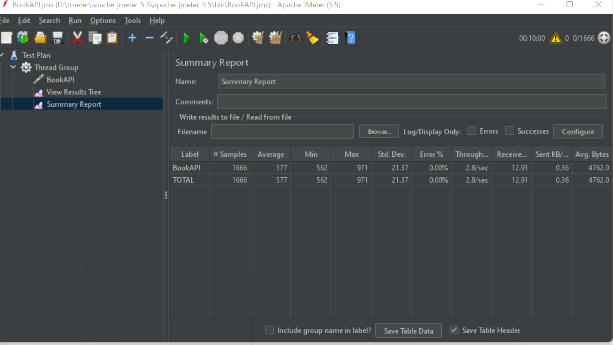

# Book-API-Load-Test
#Book-API-Load-Test by Jmeter
#### **Question**

- Find out the actual TPS for if 10000 user can give load within 1 hour **Expected load:** 10000 user, per hour.
- **Actual load:** what TPS? Breakdown the expected TPS in excel sheet and find out the actual TPS.
- For 60s, 300s and 600s load, add Jmeter UI screenshot and for 900s generate html report and take screenshot.

##### **Solved**

- #### [**Excel and Word Report**](https://github.com/Farjana71/Book-API-Load-Test/tree/main/resources)

#### **Load Test Strategy**

- [Server](https://demoqa.com/BookStore/v1/Books)

|  |
| :------------------------------------: |
|              _Actual TPS_              |

#### **JMeter Summary Report**

- 167 users for 60 seconds

|  |
| :----------------------------------: |
|         _60 sec, 167 users_          |

- 833 users for 300 seconds

|  |
| :----------------------------------: |
|         _300 sec, 833 users_         |

- 1667 users for 600 seconds

|  |
| :----------------------------------: |
|        _600 sec, 1666 users_         |

- 2500 users for 900 seconds

|  |
| :-------------------------------------: |
|          _900 sec, 2500 users_          |

- 2500 users for 900 seconds

|  |
| :-------------------------------------: |
|          _900 sec, 2500 users_          |

- Test Summary Report - 2500 users for 950 seconds

|  |
| :------------------------------------------: |
|               _Summary Report_               |
